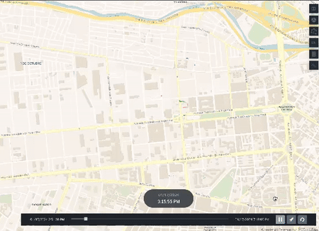
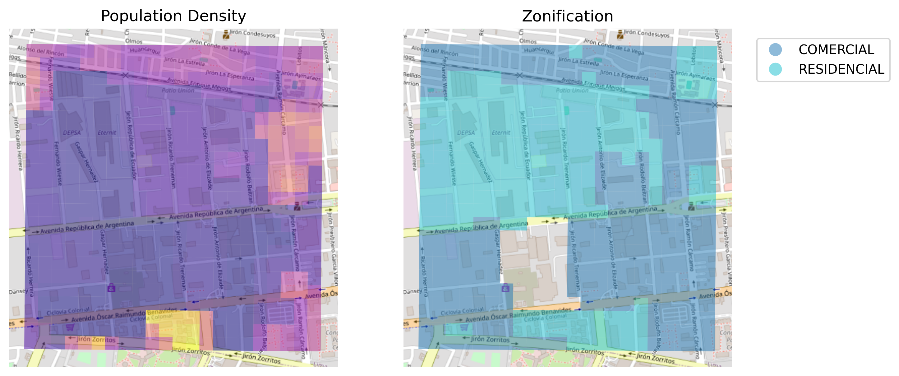

# Simple Trips Simulation using OSMnx

<!-- Div with two columns -->

  

  

  This project is a learning exercise that uses the OSMnx library to simulate daily commuting trips of people in a city. The simulation is based on a simplified set of real-world data and assumptions about human behavior, making it a great starting point for understanding urban mobility patterns.
    
    Our simulation focuses an area of the city of Lima, Peru, but the principles and methods used can be applied to any urban area. The simulation takes into account factors such as population density, zoning, and typical commuting times to generate basic trip data.
      
    This project can be a useful learning tool for students, researchers, and anyone else interested in urban mobility Read on to learn more about how the simulation works, what data it uses, and how to interpret the results. Remember, this is a simplified model and the results should be interpreted with that in mind.
    

  

  

    
  

> [!NOTE]  
> Please note that this is a simple project made for learning purposes. It does not take into account all the necessary variables and assumptions for building a realistic simulation software. For example, factors like varying travel speeds, traffic congestion, and individual preferences are not considered in this project.

## Configuration

To build a a simple Trips simulation we need to set a few initial parameters:

- Number of people in the simulation, we will use the population density to calculate this.
- Number of trips per person, we will take the asumption that each person makes 2 trips per day (to and from work)
- Where people live and where they work, we will use the zonification layer to define this:
    - Residential zones -> people's homes
    - Commercial zones -> people's work
- Schedule of the trips, we will use normal probability distributions to define this. We will use the following parameters:
    - Departure time: 6am to 8am
    - Return time: 5pm to 7pm

## What data will be used ?

The data used is a grid of a portion of the city of Lima, Peru. The grid is composed of ~1km x 1km cells and each cell has the following information:

- Population density (people per km2) from Meta's High Resolution Population Density Maps
- Zonification (residential, commercial, etc.) from the Metropolitan Planning Institute of Lima (IMP)

## How the simulation works ?

The simulation will be based on the following steps:

1. Assign each person a home and a work location based on the density and zonification layers
2. Assign each person a departure and return time based on a normal distribution
3. Calculate the fastest route between the home and work locations and viceversa using the OSMnx library as routing engine

## What is the output of the simulation ?

The output of the simulation will be a list of trips with the following information:

- Person ID: integer
- Start time: unix timestamp
- Type: string ("to_home" or "to_work")
- Path: list of coordinates (lat, lon)
- Timestamps: list of unix timestamps (one for each coordinate)

## Related links

- [Routing, speed imputation, and travel times in OSMnx](https://github.com/gboeing/osmnx-examples/blob/v0.13.0/notebooks/02-routing-speed-time.ipynb)
- [GAMA Platform Road Traffic](https://gama-platform.org/wiki/RoadTrafficModel)
- [Trips Viz in Deck.gl](https://deck.gl/examples/trips-layer)